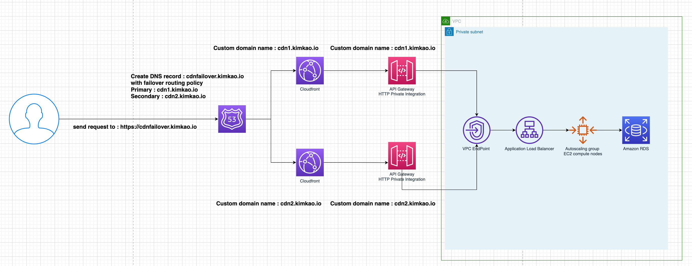
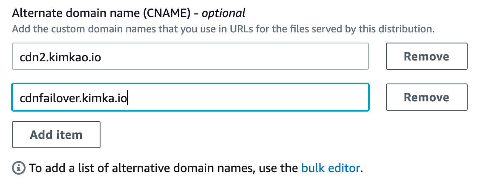
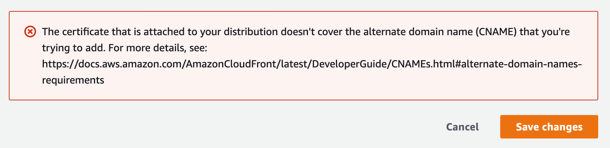

# POC for Failover Cloudfront distribution 

​    

## Summary

The POC result is - Currently (2021) , AWS Cloudfront doesn't support for **multiple origin distribution for the same domain name**, due to it is regional unique constraint. So to have 2 cloudfront distribution to serve as a failover CDN for specific domain is not workable.


## Context

It's all about redundant issue for the managed services, customers may worry about if there is any infrastructure level outage, how to minimize the impact on production workloads. However, to build up **higher availability systems with single regional managed services is to build DR site in another region.** The cost would be high and need to have clear RTO/RPO goal set to move on the progess. 

Most of the time, people would like to seek for regional redundant mechanism to achieve the desire in a cost-effective way, although it doesn't get too much robustness as expected.


### Architecture




Let's take a look on the service discovery chain and how the traffic will be.

The theme is - 

**when client user send a request to https://cdnfailover.kimkao.io, then the Route 53 service resolve the domain name as it has been registered with failover routing policy in Route 53. So the dns resolver will  get cdn1.kimkao.io back since it's the primary domain name.** The traffic will go over cdn1 --> api --> private integration with vpc resources.


## Problem

When trying to propose the above architecture, there is a classical TLS matching problem within. The origin request intention is to visit **cdnfailover.kimkao.io**, although the DNS resolve the **cdn1.kimkao.io** as the target domain name. API Gateway is responsible for receiving all of the incoming requests, so the API Gateway is needed to registered as **cdn1.kimkao.io** as well.

Based on this dns resolving result, all of the traffic will not go through CDN but directly send to API Gateway, then lead to

> CURL error 60: SSL: no alternative certificate subject name matches target host name


## Force

There are some limitation as in existing legacy workloads.

* There are 2 API gateway HTTP API  exposed to serve incoming requests, they are also private integrated with VPC private subnet resources.
* API Gateway serve as the target host, so the domain name, alternate domain name should be registered with the failvoered 2 domains (cdn1.kimkao.io, and cdn2.kimkao.io)

## Solutions

To make the DNS resolving works well, we need to modify all of the DNS records, Cloudfront distributions as below.

### Lambda@Edge

The entire architecture is leveraging route53 to deal with servcie lookup for healthy CDN endpoint, and pass  all of the requests through multiple network components.

> Client --> Ask route53 --> visit cdn primary endpoint --> go Origin to API Gateway --> through VPCLink to ALB --> proxy request to backend EC2.

When working on these network traffic, do need to make sure the request header matches destination host name. However, when request ask to visit https://cdnfailover.kimkao.io, this domain name is recorded on Route 53, which is not a real distribution on Cloudfront, so the cloudfront received the request will reject the request due to TLS host name doesn't match to the requested one.

How can we resolve this issue? A traditional approach is to add the "host" header in runtime, or on CloudFront. But CloudFront service doesn't allow to add host header directly. We could only leverage Lambda@Edge to override the request header in runtime. Here are the instruction guidances.

#### Lambda Function

First, create a lambda function in destination region for deploying to edge.

Function name : rewriteHostForMyDemo, Runtime : Node.js 14.x

```node.js
exports.handler =  (event, context, callback) => {
    // TODO implement
    console.log("ENVIRONMENT VARIABLES\n" + JSON.stringify(process.env, null, 2))
    console.info("EVENT\n" + JSON.stringify(event, null, 2))
    console.warn("Event not processed.")
    const request = event.Records[0].cf.request;
    request.headers.host[0].value = 'cdn1.kimkao.io';
    return callback(null, request);
    
};

```


Assign an IAM role for the lambda function, there will need to have 2 service trust relationships to assume role in edge.

for example, my IAM role : Lambdarole. Edit Trust Relationship.

```
{
  "Version": "2012-10-17",
  "Statement": [
    {
      "Effect": "Allow",
      "Principal": {
        "Service": [
          "edgelambda.amazonaws.com",
          "lambda.amazonaws.com"
        ]
      },
      "Action": "sts:AssumeRole"
    }
  ]
}
```

Deploy to desired region, take the ARN for further integration.

```
ARN : arn:aws:lambda:us-east-1:<xxxxxxxxxxxx>:function:rewriteHostForMyDemo:3
```


### CloudFront distribution setting

#### CDN distribution -1 

```
Distubrition domain name : https://d3e36777gjas6.cloudfront.net (auto-generated)
ARN : xxxx ( auto-generated)
Description : CFN1 to API 1 
Supported HTTP versions : HTTP/2, HTTP/1.x
alternate domain names : cdn1.kimkao.io, cdnfailover.kimkao.io ( to make sure the origin request header match the CDN destination)
origin domain : (set to api gateway domain name) d-q6v52yluri.execute-api.us-east-1.amazonaws.com
```

#### Behaviors

```
Viewer protocol policy : HTTP and HTTPS
Allowed HTTP methods : GET, HEAD, OPTIONS, PUT, POST, PATCH, DELETE
Restrict viewer access: No
```

#### Cache key and origin requests

```
Cache policy and origin request policy (recommend)
Cache policy :  CachingDisabled
Origin request policy : AllViewers
```


#### Function associations

```
Everything leave default but add one function for Origin request.

Rogin request : Function type as Lambda@Edge, Function ARN/ Name as you deployed lambda function ARN with version number
```


#### CDN distribution -2

You could create the second distribution as first distribution steps, but don't add the alternate domain name **cdnfailover.kimkao.io** at the time.

### Route 53 setting

* Create a DNS record with failover routing policy , domain name  - cdnfailover.kimkao.io

```
Domain name : cdnfailover.kimkao.io
Routing policy : failover
Primary : Cloudfront distribution1 - d3e36777gjas6.cloudfront.net
Secondary : Cloudfront distribution2 - d2dufh55qr16mi.cloudfront.net
```


## Result

Let's take a test 

#### nslookup to check target domain name is discoverable

```
❯ nslookup cdnfailover.kimkao.io
Server:		172.20.10.1
Address:	172.20.10.1#53

Non-authoritative answer:
cdnfailover.kimkao.io	canonical name = d3e36777gjas6.cloudfront.net.
Name:	d3e36777gjas6.cloudfront.net
Address: 13.35.164.112
Name:	d3e36777gjas6.cloudfront.net
Address: 13.35.164.54
Name:	d3e36777gjas6.cloudfront.net
Address: 13.35.164.57
Name:	d3e36777gjas6.cloudfront.net
Address: 13.35.164.66
```

#### Send the request to target domain

Check the log we could see the traffic is definitely go through CDN with

**< x-amz-cf-pop: TPE50-C1**, and 
**< x-amz-cf-id: Hej3fkfUrzSEXfhrhpKiuUggbLG_WIvfZsVHYSQJng8HG2L1WrGzOA==**

The traffic will successfully to hit API Gateway and get response.

```
❯ curl -v https://cdnfailover.kimkao.io
*   Trying 2600:9000:20db:dc00:1a:f05e:5580:93a1...
* TCP_NODELAY set
* Connected to cdnfailover.kimkao.io (2600:9000:20db:dc00:1a:f05e:5580:93a1) port 443 (#0)
* ALPN, offering h2
* ALPN, offering http/1.1
* successfully set certificate verify locations:
*   CAfile: /etc/ssl/cert.pem
  CApath: none
* TLSv1.2 (OUT), TLS handshake, Client hello (1):
* TLSv1.2 (IN), TLS handshake, Server hello (2):
* TLSv1.2 (IN), TLS handshake, Certificate (11):
* TLSv1.2 (IN), TLS handshake, Server key exchange (12):
* TLSv1.2 (IN), TLS handshake, Server finished (14):
* TLSv1.2 (OUT), TLS handshake, Client key exchange (16):
* TLSv1.2 (OUT), TLS change cipher, Change cipher spec (1):
* TLSv1.2 (OUT), TLS handshake, Finished (20):
* TLSv1.2 (IN), TLS change cipher, Change cipher spec (1):
* TLSv1.2 (IN), TLS handshake, Finished (20):
* SSL connection using TLSv1.2 / ECDHE-RSA-AES128-GCM-SHA256
* ALPN, server accepted to use h2
* Server certificate:
*  subject: CN=*.kimkao.io
*  start date: Apr 18 00:00:00 2021 GMT
*  expire date: May 17 23:59:59 2022 GMT
*  subjectAltName: host "cdnfailover.kimkao.io" matched cert's "*.kimkao.io"
*  issuer: C=US; O=Amazon; OU=Server CA 1B; CN=Amazon
*  SSL certificate verify ok.
* Using HTTP2, server supports multi-use
* Connection state changed (HTTP/2 confirmed)
* Copying HTTP/2 data in stream buffer to connection buffer after upgrade: len=0
* Using Stream ID: 1 (easy handle 0x7f82dd00f800)
> GET / HTTP/2
> Host: cdnfailover.kimkao.io
> User-Agent: curl/7.64.1
> Accept: */*
>
* Connection state changed (MAX_CONCURRENT_STREAMS == 128)!
< HTTP/2 200
< content-type: text/html
< content-length: 3009
< vary: Accept-Encoding
< date: Tue, 13 Jul 2021 14:42:48 GMT
< server: nginx/1.20.0
< apigw-requestid: CabwbhGJoAMESSg=
< last-modified: Mon, 05 Jul 2021 06:09:47 GMT
< etag: "60e2a22b-bc1"
< accept-ranges: bytes
< x-cache: Miss from cloudfront
< via: 1.1 9f6f98693a92fb28f50ee1be22989de3.cloudfront.net (CloudFront)
< x-amz-cf-pop: TPE50-C1
< x-amz-cf-id: Hej3fkfUrzSEXfhrhpKiuUggbLG_WIvfZsVHYSQJng8HG2L1WrGzOA==
<
<!DOCTYPE html PUBLIC "-//W3C//DTD XHTML 1.1//EN" "http://www.w3.org/TR/xhtml11/DTD/xhtml11.dtd">

<html xmlns="http://www.w3.org/1999/xhtml" xml:lang="en">

.... html body ignore ...
```


By doing so, we had done for

* Deal with TLS host mismatch issue by adding **cdnfailover.kimkao.io** in CDN-1 distribution alternate domain name
* Successfully to proxy requests to backend server through API Gateway HTTP API private integration


However, once trying to add the **cdnfailover.kimkao.io** to the second CDN distribution will encountered an error - 








**The adding alternate domain name error is due to the service limit, that the alternate domain name binding to regional Cloudfront distribution is regional unique. It's similar to API Gateway design concept. So there is no opportunity to leverage 2 CDN distribution to achieve 1 region HA goal so far.**


**Based on current architecture, we do suggest to have corss region DR, or make a few change on the as-is architecture to have another communication mechanism to proxy requests in seperate requests chain.**

